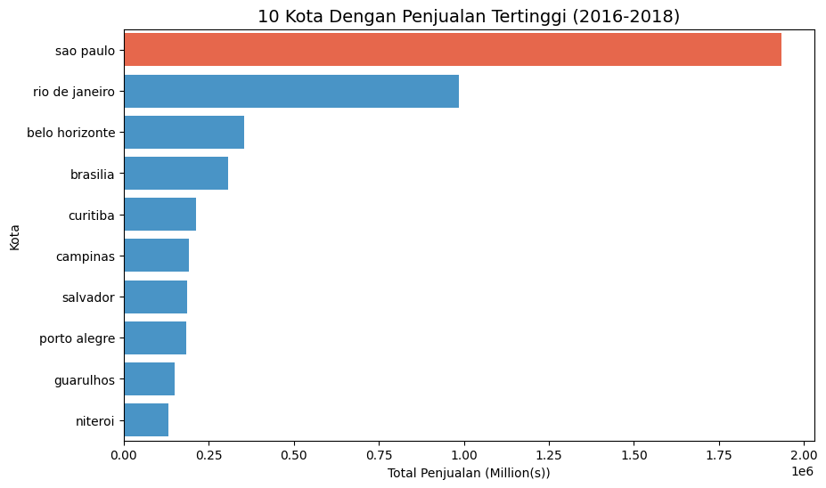
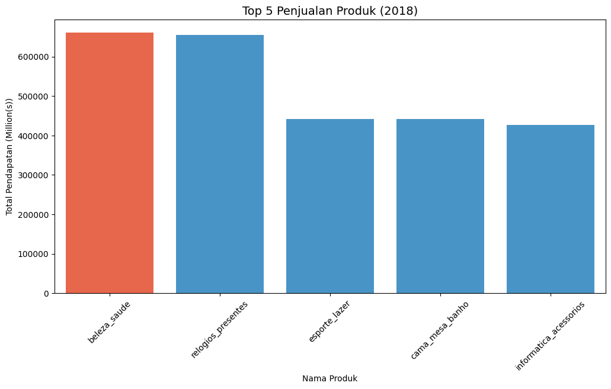
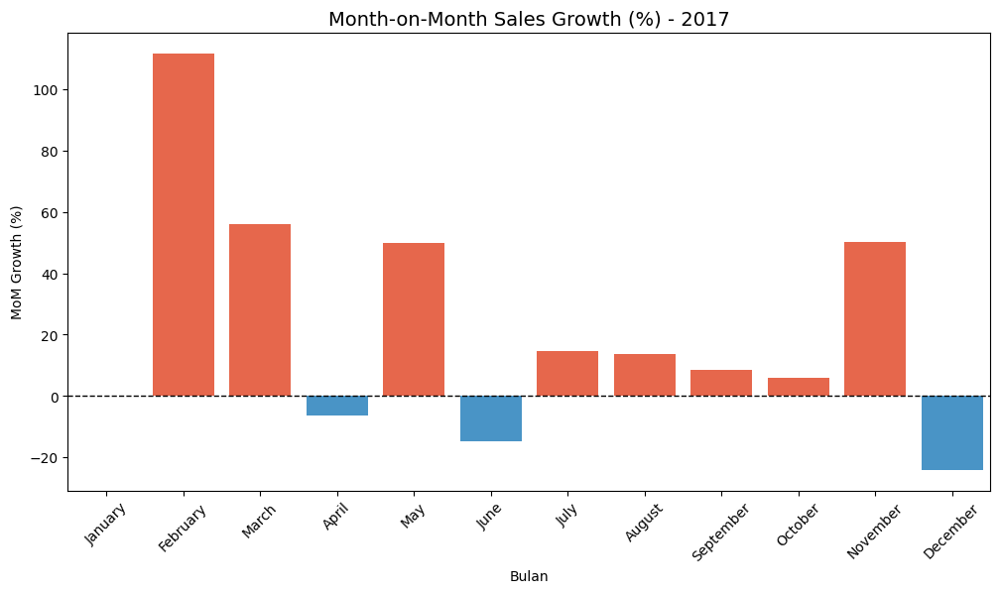

# Dashboard-Dicoding-Assignment
# Proyek Analisis Data: E-Commerce Public

- Maulana Muhammad Ikhsan
- maulanamuhammadikh@gmail.com

# Pertanyaan Bisnis

- Kota mana yang masuk ke dalam 10 peringkat teratas penjualan (2016-2018)?
- Dari seluruh produk yang dijual, manakah yang paling menguntungkan pada tahun 2018?
- Growth penjualan perbulan tahun 2017?

# Import Semua Packages/Library yang Digunakan


```python
# Import libraries/packages yang diperlukan
import pandas as pd
import numpy as np
import matplotlib.pyplot as plt
import seaborn as sns
import os
import calendar
```

# Data Wrangling

### Gathering Data


```python
# Import semua files csv yang akan digunakan
customer_data = pd.read_csv('Data/customers_dataset.csv')
geo_data = pd.read_csv('Data/geolocation_dataset.csv')
items_data = pd.read_csv('Data/order_items_dataset.csv')
order_pay_data = pd.read_csv('Data/order_payments_dataset.csv')
order_review_data = pd.read_csv('Data/order_reviews_dataset.csv')
orders_data = pd.read_csv('Data/orders_dataset.csv')
category_data = pd.read_csv('Data/product_category_name_translation.csv')
products_data = pd.read_csv('Data/products_dataset.csv')
sellers_data = pd.read_csv('Data/sellers_dataset.csv')
```


```python
# Melihat beberapa data yang sudah diimport
customer_data.head(3), geo_data.head(3), items_data.head(3), order_pay_data.head(3), order_review_data.head(3), orders_data.head(3), category_data.head(3), products_data.head(3), sellers_data.head(3)
```


    (                        customer_id                customer_unique_id  \
     0  06b8999e2fba1a1fbc88172c00ba8bc7  861eff4711a542e4b93843c6dd7febb0   
     1  18955e83d337fd6b2def6b18a428ac77  290c77bc529b7ac935b93aa66c333dc3   
     2  4e7b3e00288586ebd08712fdd0374a03  060e732b5b29e8181a18229c7b0b2b5e   
     
        customer_zip_code_prefix          customer_city customer_state  
     0                     14409                 franca             SP  
     1                      9790  sao bernardo do campo             SP  
     2                      1151              sao paulo             SP  ,
        geolocation_zip_code_prefix  geolocation_lat  geolocation_lng  \
     0                         1037       -23.545621       -46.639292   
     1                         1046       -23.546081       -46.644820   
     2                         1046       -23.546129       -46.642951   
     
       geolocation_city geolocation_state  
     0        sao paulo                SP  
     1        sao paulo                SP  
     2        sao paulo                SP  ,
                                order_id  order_item_id  \
     0  00010242fe8c5a6d1ba2dd792cb16214              1   
     1  00018f77f2f0320c557190d7a144bdd3              1   
     2  000229ec398224ef6ca0657da4fc703e              1   
     
                              product_id                         seller_id  \
     0  4244733e06e7ecb4970a6e2683c13e61  48436dade18ac8b2bce089ec2a041202   
     1  e5f2d52b802189ee658865ca93d83a8f  dd7ddc04e1b6c2c614352b383efe2d36   
     2  c777355d18b72b67abbeef9df44fd0fd  5b51032eddd242adc84c38acab88f23d   
     
        shipping_limit_date  price  freight_value  
     0  2017-09-19 09:45:35   58.9          13.29  
     1  2017-05-03 11:05:13  239.9          19.93  
     2  2018-01-18 14:48:30  199.0          17.87  ,
                                order_id  payment_sequential payment_type  \
     0  b81ef226f3fe1789b1e8b2acac839d17                   1  credit_card   
     1  a9810da82917af2d9aefd1278f1dcfa0                   1  credit_card   
     2  25e8ea4e93396b6fa0d3dd708e76c1bd                   1  credit_card   
     
        payment_installments  payment_value  
     0                     8          99.33  
     1                     1          24.39  
     2                     1          65.71  ,
                               review_id                          order_id  \
     0  7bc2406110b926393aa56f80a40eba40  73fc7af87114b39712e6da79b0a377eb   
     1  80e641a11e56f04c1ad469d5645fdfde  a548910a1c6147796b98fdf73dbeba33   
     2  228ce5500dc1d8e020d8d1322874b6f0  f9e4b658b201a9f2ecdecbb34bed034b   
     
        review_score review_comment_title review_comment_message  \
     0             4                  NaN                    NaN   
     1             5                  NaN                    NaN   
     2             5                  NaN                    NaN   
     
       review_creation_date review_answer_timestamp  
     0  2018-01-18 00:00:00     2018-01-18 21:46:59  
     1  2018-03-10 00:00:00     2018-03-11 03:05:13  
     2  2018-02-17 00:00:00     2018-02-18 14:36:24  ,
                                order_id                       customer_id  \
     0  e481f51cbdc54678b7cc49136f2d6af7  9ef432eb6251297304e76186b10a928d   
     1  53cdb2fc8bc7dce0b6741e2150273451  b0830fb4747a6c6d20dea0b8c802d7ef   
     2  47770eb9100c2d0c44946d9cf07ec65d  41ce2a54c0b03bf3443c3d931a367089   
     
       order_status order_purchase_timestamp    order_approved_at  \
     0    delivered      2017-10-02 10:56:33  2017-10-02 11:07:15   
     1    delivered      2018-07-24 20:41:37  2018-07-26 03:24:27   
     2    delivered      2018-08-08 08:38:49  2018-08-08 08:55:23   
     
       order_delivered_carrier_date order_delivered_customer_date  \
     0          2017-10-04 19:55:00           2017-10-10 21:25:13   
     1          2018-07-26 14:31:00           2018-08-07 15:27:45   
     2          2018-08-08 13:50:00           2018-08-17 18:06:29   
     
       order_estimated_delivery_date  
     0           2017-10-18 00:00:00  
     1           2018-08-13 00:00:00  
     2           2018-09-04 00:00:00  ,
         product_category_name product_category_name_english
     0            beleza_saude                 health_beauty
     1  informatica_acessorios         computers_accessories
     2              automotivo                          auto,
                              product_id product_category_name  \
     0  1e9e8ef04dbcff4541ed26657ea517e5            perfumaria   
     1  3aa071139cb16b67ca9e5dea641aaa2f                 artes   
     2  96bd76ec8810374ed1b65e291975717f         esporte_lazer   
     
        product_name_lenght  product_description_lenght  product_photos_qty  \
     0                 40.0                       287.0                 1.0   
     1                 44.0                       276.0                 1.0   
     2                 46.0                       250.0                 1.0   
     
        product_weight_g  product_length_cm  product_height_cm  product_width_cm  
     0             225.0               16.0               10.0              14.0  
     1            1000.0               30.0               18.0              20.0  
     2             154.0               18.0                9.0              15.0  ,
                               seller_id  seller_zip_code_prefix     seller_city  \
     0  3442f8959a84dea7ee197c632cb2df15                   13023        campinas   
     1  d1b65fc7debc3361ea86b5f14c68d2e2                   13844      mogi guacu   
     2  ce3ad9de960102d0677a81f5d0bb7b2d                   20031  rio de janeiro   
     
       seller_state  
     0           SP  
     1           SP  
     2           RJ  )


```python
# Menggabungkan data menjadi satu dataframe besar
ecommerce_data = orders_data.merge(items_data, on='order_id', how='left')
ecommerce_data = ecommerce_data.merge(order_pay_data, on='order_id', how='outer', validate='m:m')
ecommerce_data = ecommerce_data.merge(order_review_data, on='order_id', how='outer')
ecommerce_data = ecommerce_data.merge(products_data, on='product_id', how='outer')
ecommerce_data = ecommerce_data.merge(customer_data, on='customer_id', how='outer')
ecommerce_data = ecommerce_data.merge(sellers_data, on='seller_id', how='outer')

print(ecommerce_data.shape)
```

    (119143, 39)


Insight:
   - Import semua files yang terdapat pada e-commerce public dataset.
   - Setelah itu, menggunakan .head() untuk melihat kolom mana saja yang dapat kita merge/join.
   - Melakukan penggabungan seluruh data menjadi satu data frame yang dapat digunakan.

### Assesing Data


```python
# Melihat informasi dari dataframe
ecommerce_data.info()
ecommerce_data.describe()
```

    <class 'pandas.core.frame.DataFrame'>
    RangeIndex: 119143 entries, 0 to 119142
    Data columns (total 39 columns):
     #   Column                         Non-Null Count   Dtype  
    ---  ------                         --------------   -----  
     0   order_id                       119143 non-null  object 
     1   customer_id                    119143 non-null  object 
     2   order_status                   119143 non-null  object 
     3   order_purchase_timestamp       119143 non-null  object 
     4   order_approved_at              118966 non-null  object 
     5   order_delivered_carrier_date   117057 non-null  object 
     6   order_delivered_customer_date  115722 non-null  object 
     7   order_estimated_delivery_date  119143 non-null  object 
     8   order_item_id                  118310 non-null  float64
     9   product_id                     118310 non-null  object 
     10  seller_id                      118310 non-null  object 
     11  shipping_limit_date            118310 non-null  object 
     12  price                          118310 non-null  float64
     13  freight_value                  118310 non-null  float64
     14  payment_sequential             119140 non-null  float64
     15  payment_type                   119140 non-null  object 
     16  payment_installments           119140 non-null  float64
     17  payment_value                  119140 non-null  float64
     18  review_id                      118146 non-null  object 
     19  review_score                   118146 non-null  float64
     20  review_comment_title           13989 non-null   object 
     21  review_comment_message         50245 non-null   object 
     22  review_creation_date           118146 non-null  object 
     23  review_answer_timestamp        118146 non-null  object 
     24  product_category_name          116601 non-null  object 
     25  product_name_lenght            116601 non-null  float64
     26  product_description_lenght     116601 non-null  float64
     27  product_photos_qty             116601 non-null  float64
     28  product_weight_g               118290 non-null  float64
     29  product_length_cm              118290 non-null  float64
     30  product_height_cm              118290 non-null  float64
     31  product_width_cm               118290 non-null  float64
     32  customer_unique_id             119143 non-null  object 
     33  customer_zip_code_prefix       119143 non-null  int64  
     34  customer_city                  119143 non-null  object 
     35  customer_state                 119143 non-null  object 
     36  seller_zip_code_prefix         118310 non-null  float64
     37  seller_city                    118310 non-null  object 
     38  seller_state                   118310 non-null  object 
    dtypes: float64(15), int64(1), object(23)
    memory usage: 35.5+ MB


<div>
<style scoped>
    .dataframe tbody tr th:only-of-type {
        vertical-align: middle;
    }

    .dataframe tbody tr th {
        vertical-align: top;
    }

    .dataframe thead th {
        text-align: right;
    }
</style>
<table border="1" class="dataframe">
  <thead>
    <tr style="text-align: right;">
      <th></th>
      <th>order_item_id</th>
      <th>price</th>
      <th>freight_value</th>
      <th>payment_sequential</th>
      <th>payment_installments</th>
      <th>payment_value</th>
      <th>review_score</th>
      <th>product_name_lenght</th>
      <th>product_description_lenght</th>
      <th>product_photos_qty</th>
      <th>product_weight_g</th>
      <th>product_length_cm</th>
      <th>product_height_cm</th>
      <th>product_width_cm</th>
      <th>customer_zip_code_prefix</th>
      <th>seller_zip_code_prefix</th>
    </tr>
  </thead>
  <tbody>
    <tr>
      <th>count</th>
      <td>118310.000000</td>
      <td>118310.000000</td>
      <td>118310.000000</td>
      <td>119140.000000</td>
      <td>119140.000000</td>
      <td>119140.000000</td>
      <td>118146.000000</td>
      <td>116601.000000</td>
      <td>116601.000000</td>
      <td>116601.000000</td>
      <td>118290.000000</td>
      <td>118290.000000</td>
      <td>118290.000000</td>
      <td>118290.000000</td>
      <td>119143.000000</td>
      <td>118310.000000</td>
    </tr>
    <tr>
      <th>mean</th>
      <td>1.196543</td>
      <td>120.646603</td>
      <td>20.032387</td>
      <td>1.094737</td>
      <td>2.941246</td>
      <td>172.735135</td>
      <td>4.015582</td>
      <td>48.767498</td>
      <td>785.967822</td>
      <td>2.205161</td>
      <td>2112.250740</td>
      <td>30.265145</td>
      <td>16.619706</td>
      <td>23.074799</td>
      <td>35033.451298</td>
      <td>24442.410413</td>
    </tr>
    <tr>
      <th>std</th>
      <td>0.699489</td>
      <td>184.109691</td>
      <td>15.836850</td>
      <td>0.730141</td>
      <td>2.777848</td>
      <td>267.776077</td>
      <td>1.400436</td>
      <td>10.033540</td>
      <td>652.584121</td>
      <td>1.717452</td>
      <td>3786.695111</td>
      <td>16.189367</td>
      <td>13.453584</td>
      <td>11.749139</td>
      <td>29823.198969</td>
      <td>27573.004511</td>
    </tr>
    <tr>
      <th>min</th>
      <td>1.000000</td>
      <td>0.850000</td>
      <td>0.000000</td>
      <td>1.000000</td>
      <td>0.000000</td>
      <td>0.000000</td>
      <td>1.000000</td>
      <td>5.000000</td>
      <td>4.000000</td>
      <td>1.000000</td>
      <td>0.000000</td>
      <td>7.000000</td>
      <td>2.000000</td>
      <td>6.000000</td>
      <td>1003.000000</td>
      <td>1001.000000</td>
    </tr>
    <tr>
      <th>25%</th>
      <td>1.000000</td>
      <td>39.900000</td>
      <td>13.080000</td>
      <td>1.000000</td>
      <td>1.000000</td>
      <td>60.850000</td>
      <td>4.000000</td>
      <td>42.000000</td>
      <td>346.000000</td>
      <td>1.000000</td>
      <td>300.000000</td>
      <td>18.000000</td>
      <td>8.000000</td>
      <td>15.000000</td>
      <td>11250.000000</td>
      <td>6429.000000</td>
    </tr>
    <tr>
      <th>50%</th>
      <td>1.000000</td>
      <td>74.900000</td>
      <td>16.280000</td>
      <td>1.000000</td>
      <td>2.000000</td>
      <td>108.160000</td>
      <td>5.000000</td>
      <td>52.000000</td>
      <td>600.000000</td>
      <td>1.000000</td>
      <td>700.000000</td>
      <td>25.000000</td>
      <td>13.000000</td>
      <td>20.000000</td>
      <td>24240.000000</td>
      <td>13660.000000</td>
    </tr>
    <tr>
      <th>75%</th>
      <td>1.000000</td>
      <td>134.900000</td>
      <td>21.180000</td>
      <td>1.000000</td>
      <td>4.000000</td>
      <td>189.240000</td>
      <td>5.000000</td>
      <td>57.000000</td>
      <td>983.000000</td>
      <td>3.000000</td>
      <td>1800.000000</td>
      <td>38.000000</td>
      <td>20.000000</td>
      <td>30.000000</td>
      <td>58475.000000</td>
      <td>27972.000000</td>
    </tr>
    <tr>
      <th>max</th>
      <td>21.000000</td>
      <td>6735.000000</td>
      <td>409.680000</td>
      <td>29.000000</td>
      <td>24.000000</td>
      <td>13664.080000</td>
      <td>5.000000</td>
      <td>76.000000</td>
      <td>3992.000000</td>
      <td>20.000000</td>
      <td>40425.000000</td>
      <td>105.000000</td>
      <td>105.000000</td>
      <td>118.000000</td>
      <td>99990.000000</td>
      <td>99730.000000</td>
    </tr>
  </tbody>
</table>
</div>


```python
# Melihat apakah ada data yang hilang (missing values) pada dataframe
ecommerce_data.isna().sum()
```


    order_id                              0
    customer_id                           0
    order_status                          0
    order_purchase_timestamp              0
    order_approved_at                   177
    order_delivered_carrier_date       2086
    order_delivered_customer_date      3421
    order_estimated_delivery_date         0
    order_item_id                       833
    product_id                          833
    seller_id                           833
    shipping_limit_date                 833
    price                               833
    freight_value                       833
    payment_sequential                    3
    payment_type                          3
    payment_installments                  3
    payment_value                         3
    review_id                           997
    review_score                        997
    review_comment_title             105154
    review_comment_message            68898
    review_creation_date                997
    review_answer_timestamp             997
    product_category_name              2542
    product_name_lenght                2542
    product_description_lenght         2542
    product_photos_qty                 2542
    product_weight_g                    853
    product_length_cm                   853
    product_height_cm                   853
    product_width_cm                    853
    customer_unique_id                    0
    customer_zip_code_prefix              0
    customer_city                         0
    customer_state                        0
    seller_zip_code_prefix              833
    seller_city                         833
    seller_state                        833
    dtype: int64


```python
# Melihat duplikat data pada dataframe
ecommerce_data.duplicated().sum()
```


    np.int64(0)


Insight:
   - Setelah menggabungkan seluruh tabel menjadi 1 dataframe melakukan pengecekan masalah yang umum dijumpai
   - Ditemukan banyaknya missing value/NULL pada dataframe ecommerce_data
   - Ditemukan beberapa duplicate data pada dataframe ecommerce_data

### Cleaning Data


```python
# Menghapus duplikat data pada dataframe
ecommerce_data.drop_duplicates(inplace=True)
```


```python
# Menghitung rasio data yang hilang (missing ratio) pada dataframe
missing_ratio = ecommerce_data.isna().mean() * 100  # percentage format
print(missing_ratio.sort_values(ascending=False))
```

    review_comment_title             88.258647
    review_comment_message           57.827988
    order_delivered_customer_date     2.871339
    product_category_name             2.133571
    product_name_lenght               2.133571
    product_description_lenght        2.133571
    product_photos_qty                2.133571
    order_delivered_carrier_date      1.750837
    review_creation_date              0.836810
    review_score                      0.836810
    review_id                         0.836810
    review_answer_timestamp           0.836810
    product_height_cm                 0.715946
    product_weight_g                  0.715946
    product_length_cm                 0.715946
    product_width_cm                  0.715946
    product_id                        0.699160
    seller_city                       0.699160
    seller_zip_code_prefix            0.699160
    freight_value                     0.699160
    seller_state                      0.699160
    seller_id                         0.699160
    order_item_id                     0.699160
    shipping_limit_date               0.699160
    price                             0.699160
    order_approved_at                 0.148561
    payment_sequential                0.002518
    payment_value                     0.002518
    payment_installments              0.002518
    payment_type                      0.002518
    order_status                      0.000000
    order_purchase_timestamp          0.000000
    order_id                          0.000000
    customer_id                       0.000000
    order_estimated_delivery_date     0.000000
    customer_city                     0.000000
    customer_zip_code_prefix          0.000000
    customer_unique_id                0.000000
    customer_state                    0.000000
    dtype: float64


```python
# Menghapus NULL values dari beberapa kolom yang sekiranya dapat digunakan untuk analisis
ecommerce_data.dropna(subset= [
    'order_approved_at',
    'order_delivered_customer_date',
    'order_item_id',
    'product_id',
    'seller_id',
    'shipping_limit_date',
    'price',
    'freight_value',
    'payment_sequential',
    'payment_type',
    'payment_installments',
    'payment_value',
    'product_category_name',
    'product_name_lenght',
    'product_description_lenght',
    'product_photos_qty',
    'product_weight_g',
    'product_length_cm',
    'product_height_cm',
    'product_width_cm'
], inplace=True)
ecommerce_data.reset_index(drop=True, inplace=True)

print(ecommerce_data.isnull().sum())
```

    order_id                              0
    customer_id                           0
    order_status                          0
    order_purchase_timestamp              0
    order_approved_at                     0
    order_delivered_carrier_date          1
    order_delivered_customer_date         0
    order_estimated_delivery_date         0
    order_item_id                         0
    product_id                            0
    seller_id                             0
    shipping_limit_date                   0
    price                                 0
    freight_value                         0
    payment_sequential                    0
    payment_type                          0
    payment_installments                  0
    payment_value                         0
    review_id                           849
    review_score                        849
    review_comment_title             100564
    review_comment_message            66697
    review_creation_date                849
    review_answer_timestamp             849
    product_category_name                 0
    product_name_lenght                   0
    product_description_lenght            0
    product_photos_qty                    0
    product_weight_g                      0
    product_length_cm                     0
    product_height_cm                     0
    product_width_cm                      0
    customer_unique_id                    0
    customer_zip_code_prefix              0
    customer_city                         0
    customer_state                        0
    seller_zip_code_prefix                0
    seller_city                           0
    seller_state                          0
    dtype: int64


Insight:
   - Menghapus duplicate_values pada dataframe
   - Menghitung persentase untuk menentukan missing values yang akan dibersihkan
   - Menghapus missing values sesuai keperluan analisis

# Exploratory Data Analysis (EDA)

### Explore


```python
# Menentukan 10 kota dengan penjualan terbanyak (2016-2018)
top10_cities = ecommerce_data.groupby('customer_city')['price'].sum().sort_values(ascending=False).head(10)
print(top10_cities)
```

    customer_city
    sao paulo         1933844.12
    rio de janeiro     986652.21
    belo horizonte     354842.89
    brasilia           305588.55
    curitiba           211495.90
    campinas           192011.50
    salvador           185548.46
    porto alegre       184550.11
    guarulhos          148530.42
    niteroi            130371.81
    Name: price, dtype: float64


```python
# Produk mana yang paling banyak terjual pada tahun 2018?
ecommerce_data['order_approved_at'] = pd.to_datetime(ecommerce_data['order_approved_at'])
ecommerce_2018 = ecommerce_data[ecommerce_data['order_approved_at'].dt.year == 2018]
ecommerce_2018['profit'] = ecommerce_2018['price'] - ecommerce_2018['freight_value']
profitable = ecommerce_2018.groupby('product_category_name')['profit'].sum().sort_values(ascending=False).head(1)
print(profitable)
```

    product_category_name
    beleza_saude    660848.41
    Name: profit, dtype: float64


```python
# Growth per bulan pada tahun 2017
ecommerce_data['order_approved_at'] = pd.to_datetime(ecommerce_data['order_approved_at'])
ecommerce_data['order_year'] = ecommerce_data['order_approved_at'].dt.year
ecommerce_data['order_month'] = ecommerce_data['order_approved_at'].dt.month
ecommerce_2017 = ecommerce_data[ecommerce_data['order_year'] == 2017]

penjualan_bulanan = ecommerce_2017.groupby(['order_year', 'order_month'])['price'].sum().reset_index()
penjualan_bulanan = penjualan_bulanan.sort_values(['order_year', 'order_month'])
penjualan_bulanan['mom_growth_percent'] = penjualan_bulanan['price'].pct_change() * 100
print(penjualan_bulanan)
```

        order_year  order_month       price  mom_growth_percent
    0         2017            1   112803.01                 NaN
    1         2017            2   238924.10          111.806493
    2         2017            3   372973.80           56.105558
    3         2017            4   348701.97           -6.507650
    4         2017            5   522253.89           49.770846
    5         2017            6   444283.63          -14.929570
    6         2017            7   509355.72           14.646520
    7         2017            8   579504.80           13.772120
    8         2017            9   629608.84            8.646009
    9         2017           10   666995.02            5.938001
    10        2017           11  1001710.95           50.182673
    11        2017           12   761193.65          -24.010649


Insight:
   - Setelah dilakukan eksplorasi pada e-commerce datasets, telah ditemukan 10 kota dengan penjualan tertinggi  menggunakan .groupby('customer_city') dengan ['price']
   - Kemudian, ditemukan dari seluruh produk mana yang paling diminati pada tahun 2018 dengan rumus mengurangi ['price'] dengan ['freight_value'] dan .groupby('product_category_name')['profit']
   - Growth MoM pada tahun 2017 menggunakan .groupby(['order_year','order_month'])['price'] dan menghitung persentasenya menggunakan ['price'].pct_change()*100

# Visualization and Explanatory Analysis

### Pertanyaan 1


```python
top10_cities = ecommerce_data.groupby('customer_city')['price'].sum().sort_values(ascending=False).head(10)

colors = ['#FF5733'] + ['#3498DB'] * (len(top10_cities) - 1)

plt.figure(figsize=(10, 6))
sns.barplot(x=top10_cities.values, y=top10_cities.index, palette=colors)
plt.title('10 Kota Dengan Penjualan Tertinggi (2016-2018)', fontsize=14)
plt.xlabel('Total Penjualan (Million(s))')
plt.ylabel('Kota')
plt.show()
```



    

### Pertanyaan 2

```python
ecommerce_data['order_approved_at'] = pd.to_datetime(ecommerce_data['order_approved_at'])
ecommerce_2018 = ecommerce_data[ecommerce_data['order_approved_at'].dt.year == 2018]
ecommerce_2018['profit'] = ecommerce_2018['price'] - ecommerce_2018['freight_value']
most_profitable = ecommerce_2018.groupby('product_category_name')['profit'].sum().sort_values(ascending=False).head(5)

colors = ['#FF5733'] + ['#3498DB'] * (len(most_profitable) - 1)

plt.figure(figsize=(12, 6))
sns.barplot(x=most_profitable.index.astype(str), y=most_profitable.values, palette=colors)
plt.title('Top 5 Penjualan Produk (2018)', fontsize=14)
plt.xlabel('Nama Produk')
plt.ylabel('Total Pendapatan (Million(s))')
plt.xticks(rotation=45)
plt.show()
```





### Pertanyaan 3


```python
ecommerce_2017 = ecommerce_data[ecommerce_data['order_year'] == 2017]
penjualan_bulanan = ecommerce_2017.groupby(['order_year', 'order_month'])['price'].sum().reset_index()
penjualan_bulanan = penjualan_bulanan.sort_values(['order_year', 'order_month'])
penjualan_bulanan['mom_growth_percent'] = penjualan_bulanan['price'].pct_change() * 100

nama_bulan = [calendar.month_name[m] for m in penjualan_bulanan['order_month']]

colors = ['#FF5733' if growth > 0 else '#3498DB' for growth in penjualan_bulanan['mom_growth_percent']]

plt.figure(figsize=(12, 6))
sns.barplot(x=nama_bulan, y=penjualan_bulanan['mom_growth_percent'], palette=colors)
plt.title('Month-on-Month Sales Growth (%) - 2017', fontsize=14)
plt.xlabel('Bulan')
plt.ylabel('MoM Growth (%)')
plt.xticks(rotation=45)
plt.axhline(0, color='black', linestyle='--', linewidth=1)
plt.show()
```





# Conclusion

- Untuk 10 kota dengan penjualan tertinggi yang ada didalam e-commerce dataset, ditemukan bahwa sao paulo merupakan pasar yang paling profitable dalam penjualan seluruh produk diangka R$1,933,844 (2016-2018).
- Untuk produk dengan penjualan terbanyak pada tahun 2018 yang paling profitable ada diangka R$660,848.
- Perhitungan growth% penjualan MoM sepanjang tahun 2017 ditemukan growth tertinggi ada pada bulan februari dengan persentasi mencapai 112% growth.

```python
# Menyimpan file yang akand digunakan untuk dimasukan ke dashboard Streamlit
ecommerce_data.to_csv("ecommerce_cleaned.csv", index=False)
```

## Setup Environment - Shell/Terminal
```
mkdir Analisis_Data_dengan_Python_Maulana_Muhammad_Ikhsan
cd Analisis_Data_dengan_Python_Maulana_Muhammad_Ikhsan/Dashboard
pipenv install
pipenv shell
pip install -r requirements.txt
```

## Run Streamlit App
```
streamlit run "Dashboard_Assignment.py"
```
